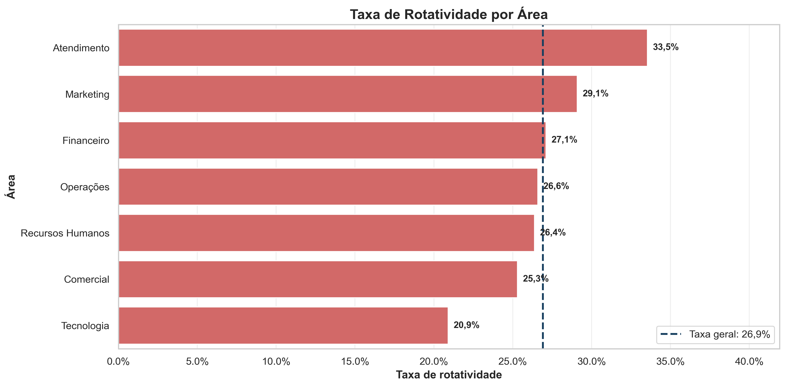
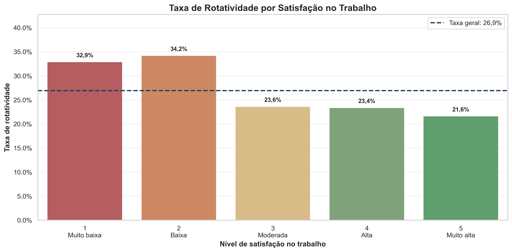
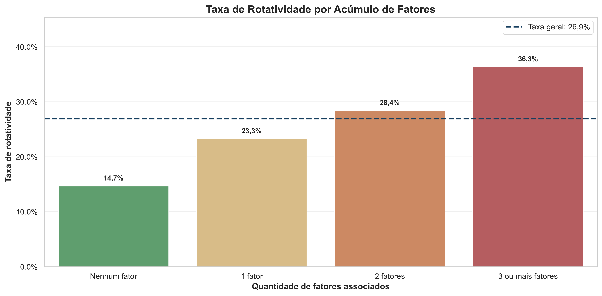

# People Analytics — Análise de Rotatividade de Colaboradores

Projeto de análise de dados desenvolvido para investigar os principais fatores associados à rotatividade de colaboradores e transformar os resultados em recomendações para retenção, desenvolvimento e gestão de pessoas.

A solução contempla preparação dos dados, análise exploratória com Python, visualizações, indicadores executivos e geração de arquivos para utilização no Power BI.

## Problema de Negócio

A rotatividade pode gerar custos com recrutamento, seleção, treinamento e perda de conhecimento. Para apoiar decisões de People Analytics, este projeto busca responder:

* Qual é a taxa geral de rotatividade?
* Quais áreas apresentam maior proporção de desligamentos?
* Horas extras estão associadas à maior rotatividade?
* Como satisfação e equilíbrio entre vida e trabalho se relacionam com os desligamentos?
* Em qual período da jornada do colaborador ocorre maior risco de saída?
* Remuneração e promoção estão associadas à permanência?
* O acúmulo de fatores aumenta a taxa de rotatividade?

## Base de Dados

A base sintética foi criada exclusivamente para fins educacionais e de portfólio.

### Estrutura inicial

* 1.212 registros brutos
* 23 variáveis
* 12 registros duplicados
* 43 valores ausentes intencionais

### Estrutura após o tratamento

* 1.200 registros únicos
* Nenhuma duplicidade
* Valores ausentes tratados
* Tipos de dados padronizados
* Regras de qualidade validadas

A base não contém dados pessoais reais.

## Tecnologias Utilizadas

* Python
* Pandas
* NumPy
* Matplotlib
* Seaborn
* OpenPyXL
* Jupyter Notebook
* Power BI
* Git e GitHub

## Estrutura do Projeto

```text
RH Analytics
├── data
│   ├── People_Analytics_Base_Tratada.csv
│   ├── People_Analytics_Base_Tratada.xlsx
│   ├── People_Analytics_Base_Analitica.csv
│   └── People_Analytics_Resumo_KPIs.csv
├── imagens
│   ├── distribuicao_rotatividade.png
│   ├── rotatividade_por_area.png
│   ├── rotatividade_por_horas_extras.png
│   ├── rotatividade_por_satisfacao_trabalho.png
│   ├── rotatividade_por_tempo_empresa.png
│   ├── rotatividade_por_faixa_salarial.png
│   ├── rotatividade_por_promocao.png
│   ├── rotatividade_por_equilibrio_vida_trabalho.png
│   └── rotatividade_por_acumulo_de_fatores.png
├── notebooks
│   ├── 01_etl.ipynb
│   └── 02_eda.ipynb
├── powerBi
│   └── People_Analytics_Resumo_Executivo.xlsx
├── sql
├── .gitignore
├── README.md
└── requirements.txt
```

## Metodologia

### 1. Preparação e tratamento

* Importação da base em Excel
* Diagnóstico da estrutura
* Identificação de duplicidades
* Identificação de valores ausentes
* Preservação da base bruta
* Remoção de 12 duplicidades
* Tratamento de 43 valores ausentes
* Padronização dos tipos de dados
* Validação de regras de qualidade
* Exportação da base tratada

### 2. Análise exploratória

* Cálculo dos KPIs gerais
* Rotatividade por área
* Relação com horas extras
* Satisfação no trabalho
* Tempo de empresa
* Faixa salarial
* Histórico de promoção
* Equilíbrio entre vida e trabalho
* Acúmulo de fatores associados

## Principais Indicadores

| Indicador                  |   Resultado |
| -------------------------- | ----------: |
| Total de colaboradores     |       1.200 |
| Colaboradores ativos       |         877 |
| Colaboradores desligados   |         323 |
| Taxa geral de rotatividade |      26,92% |
| Idade média                |   41,1 anos |
| Tempo médio de empresa     |    6,0 anos |
| Salário médio              | R$ 9.086,42 |

## Principais Resultados

### Rotatividade por área

Atendimento apresentou a maior taxa de rotatividade, com 33,5%, enquanto Tecnologia registrou a menor, com 20,9%.



### Horas extras

Colaboradores que realizam horas extras apresentaram taxa de 29,2%, contra 25,6% entre aqueles que não realizam.

### Satisfação no trabalho

Os níveis baixos de satisfação apresentaram taxas superiores a 32%. Entre colaboradores com satisfação muito alta, a taxa foi de 21,6%.



### Tempo de empresa

O período de maior rotatividade está concentrado nos três primeiros anos:

* Até 1 ano: 31,9%
* Entre 2 e 3 anos: 31,0%
* Entre 4 e 6 anos: 22,1%

### Faixa salarial

A rotatividade apresentou redução conforme o nível salarial aumentou:

* Menores salários: 30,0%
* Maiores salários: 23,7%

### Promoção

Colaboradores sem promoção nos últimos cinco anos apresentaram taxa de 28,52%. Entre os promovidos, o indicador foi de 22,07%.

### Equilíbrio entre vida e trabalho

O nível mais baixo de equilíbrio apresentou taxa de 33,5%. Nos níveis moderados e altos, os indicadores permaneceram abaixo da taxa geral.

### Acúmulo de fatores

A taxa aumentou progressivamente conforme os fatores associados se acumularam:

* Nenhum fator: 14,7%
* Um fator: 23,3%
* Dois fatores: 28,4%
* Três ou mais fatores: 36,3%

A rotatividade do grupo com três ou mais fatores foi aproximadamente 2,5 vezes maior que a do grupo sem fatores.



## Decisões Orientadas pelos Dados

| Evidência                                      | Decisão recomendada                               |
| ---------------------------------------------- | ------------------------------------------------- |
| Atendimento possui a maior rotatividade        | Priorizar a área no plano de retenção             |
| Rotatividade elevada nos primeiros três anos   | Fortalecer onboarding e acompanhamento inicial    |
| Maior rotatividade com horas extras            | Revisar capacidade e distribuição do trabalho     |
| Satisfação baixa associada a desligamentos     | Desenvolver ações de clima e liderança            |
| Menores salários apresentam maior rotatividade | Avaliar competitividade e equidade salarial       |
| Não promovidos apresentam maior rotatividade   | Estruturar carreira e mobilidade interna          |
| Equilíbrio baixo associado a desligamentos     | Ampliar iniciativas de flexibilidade e bem-estar  |
| Acúmulo de fatores aumenta a rotatividade      | Priorizar ações agregadas em grupos mais expostos |

## Recomendações

1. Reestruturar o onboarding com metas de 30, 60 e 90 dias.
2. Realizar conversas de permanência aos 6, 12 e 24 meses.
3. Priorizar a área de Atendimento nas ações de retenção.
4. Monitorar horas extras e carga de trabalho por equipe.
5. Desenvolver planos de ação para satisfação e clima.
6. Criar critérios transparentes de promoção.
7. Ampliar oportunidades de mobilidade interna.
8. Revisar a competitividade das faixas salariais iniciais.
9. Construir um dashboard mensal de People Analytics.
10. Comparar os indicadores antes e depois das iniciativas.

## Limitações e Uso Responsável

A base utilizada é sintética e os resultados representam associações presentes nos dados, não relações comprovadas de causa e efeito.

O indicador de fatores acumulados possui caráter exploratório. Ele deve ser utilizado para análises agregadas e planejamento organizacional, nunca para classificar, punir ou tomar decisões individuais sobre colaboradores.

## Como Executar o Projeto

Clone o repositório:

```bash
git clone URL_DO_REPOSITORIO
cd NOME_DO_REPOSITORIO
```

Crie o ambiente virtual:

```bash
python -m venv .venv
```

Ative o ambiente no Windows:

```powershell
.venv\Scripts\activate
```

No Linux ou macOS:

```bash
source .venv/bin/activate
```

Instale as dependências:

```bash
pip install -r requirements.txt
```

Execute os notebooks na seguinte ordem:

1. `notebooks/01_etl.ipynb`
2. `notebooks/02_eda.ipynb`

## Autor

Leandro Gomes
Profissional em transição para Dados e Business Intelligence, com experiência em gestão de negócios, indicadores, rentabilidade e apoio à tomada de decisão.

[GitHub — leandroanalytics](https://github.com/leandroanalytics)
